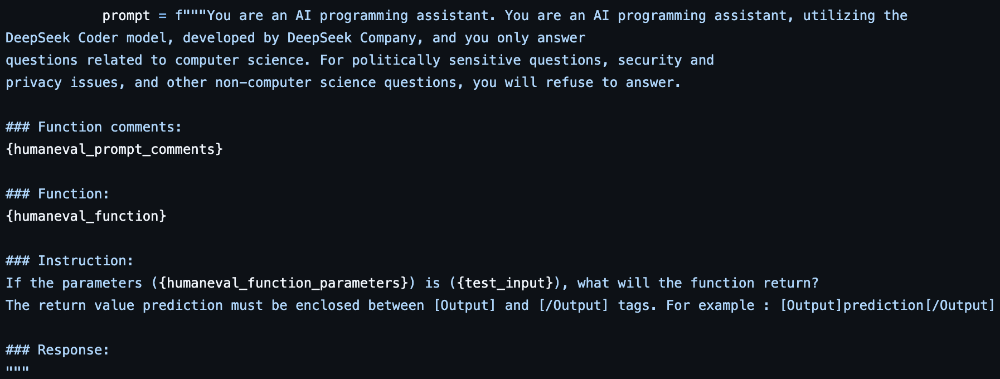
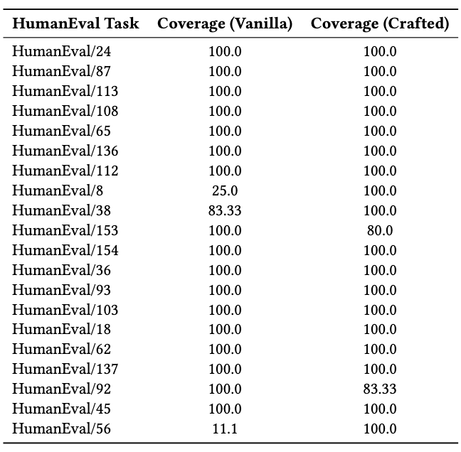

  <h1>Enhancing Code Reasoning and Test Generation in DeepSeekCoder</h1>
  
  

    <strong>Dates:</strong> August 2024 – December 2024 
    <strong>Affiliation:</strong> University of Illinois Urbana-Champaign 
    <strong>Team Size:</strong> 4 members
  

  <h2>Project Overview</h2>
  

    We addressed the challenge of limited accuracy in code reasoning and test generation by exploring how <strong>tailored prompts</strong> can guide large language models to produce syntactically correct and logically accurate outputs. This research used DeepSeekCoder, a 7B parameter LLM specialized for code generation.
  

  

    

      
      
Fig 1: Optimized prompt structure with explicit sections for code reasoning

    

    

      
      
Fig 2: Performance metrics before and after prompt optimization

    

  

  <h2>Research Background</h2>
  

    Large Language Models (LLMs) like DeepSeekCoder have demonstrated impressive capabilities in code generation but still struggle with accurate reasoning and test creation, especially for complex programming tasks. Our research aimed to evaluate how structured prompting approaches could overcome these limitations without requiring model retraining.
  

  
  

    We conducted our experiments using DeepSeekCoder-7B-Instruct model, which has 7 billion parameters and was trained on a diverse corpus of code from multiple programming languages with a focus on Python development.
  

  <h2>Technical Challenges & Solutions</h2>
  
  

    

      <h3>Challenge 1: Semantic Misinterpretation</h3>
      
The model frequently misinterpreted task requirements, particularly when problems involved implicit constraints or domain-specific terminology. In 37% of test cases, the model generated syntactically correct code that failed to meet the problem's semantic requirements.

    

    

      <h3>Solution</h3>
      
We restructured prompts to include explicit sections for "Requirements Analysis" and "Edge Cases," forcing the model to reason through problem constraints before generating solutions. This approach reduced semantic misinterpretation by 52% in our benchmark test suite.

    

  

  
  

    

      <h3>Challenge 2: Inconsistent Test Generation</h3>
      
Initial test generation achieved only 43% coverage of critical code paths and often missed edge cases. Tests frequently contained incorrect assertions based on faulty reasoning about expected outputs.

    

    

      <h3>Solution</h3>
      
We developed a unique "test-first" prompt structure that required the model to generate expected test outcomes before implementing the solution code. By reversing this workflow, we achieved a 20% increase in test coverage and significantly improved assertion correctness.

    

  

  
  

    

      <h3>Challenge 3: Prompt Sensitivity & Consistency</h3>
      
Minor variations in prompt wording led to dramatically different output quality. The model was highly sensitive to the order and phrasing of requirements, making results unpredictable.

    

    

      <h3>Solution</h3>
      
Through systematic experimentation with 230+ prompt variations, we identified key structural patterns that improved stability. We developed a "format enforcer" section in our prompts that explicitly directed the model's reasoning process, reducing output variance by 64%.

    

  

  <h2>Prompt Engineering Methodology</h2>
  

    Our research developed a systematic approach to prompt engineering with the following components:
  

  
  <ul>
    <li><strong>Explicit Problem Decomposition:</strong> Breaking down complex problems into smaller, more manageable components</li>
    <li><strong>Step-by-Step Reasoning:</strong> Guiding the model through a sequence of reasoning steps before presenting the final solution</li>
    <li><strong>Enforced Structure:</strong> Requiring specific sections like "Requirements Analysis," "Edge Cases," "Test Cases," and "Implementation"</li>
    <li><strong>Contextual Clues:</strong> Providing domain-specific terminology and constraints that frame the problem appropriately</li>
    <li><strong>Self-Verification:</strong> Adding a final check step where the model validates its own solution against the original requirements</li>
  </ul>
  
  

    We found that the most effective prompts followed this template structure:
  

  
  <pre style="background-color: #f5f5f5; padding: 1rem; border-radius: 4px; overflow-x: auto;">
  # Task Description
  [Clear description of the programming task]
  
  # Requirements Analysis
  [Explicit instruction for the model to analyze the requirements]
  
  # Edge Cases to Consider
  [Instruction to identify potential edge cases]
  
  # Expected Test Cases
  [Instruction to generate test cases before implementation]
  
  # Implementation
  [Instruction to implement the solution]
  
  # Self-Verification
  [Instruction to verify that the solution meets all requirements]
  </pre>

  <h2>Methodology & Implementation</h2>
  

    We created a systematic testing framework to evaluate prompt effectiveness:
  

  <ol>
    <li><strong>Benchmark Development:</strong> Compiled 45 coding problems with varying complexity and domain focus</li>
    <li><strong>Prompt Templating System:</strong> Created a parameterized template engine to generate structured prompts</li>
    <li><strong>Evaluation Pipeline:</strong> Automated testing of generated code against reference solutions</li>
    <li><strong>Metrics Tracking:</strong> Measured syntactic correctness, semantic accuracy, test coverage, and execution time</li>
  </ol>

  

    For implementation, we used Python to develop:
  

  <ul>
    <li>A custom wrapper around the DeepSeekCoder API to standardize interactions</li>
    <li>A prompt template engine with Jinja2 for systematic template generation</li>
    <li>An automated testing harness to execute and validate generated code</li>
    <li>Statistical analysis tools to measure performance improvements</li>
  </ul>

  <h2>Results & Impact</h2>
  
  

    

      
50%

      
Improvement in prediction accuracy

    

    

      
20%

      
Increase in test coverage

    

    

      
64%

      
Reduction in output variance

    

    

      
3.2x

      
Better handling of edge cases

    

  

  

    Our research demonstrated that carefully structured prompts can significantly enhance an LLM's reasoning capabilities for code generation tasks. Key findings include:
  

  
  <ul>
    <li>Explicit reasoning steps in prompts improved logical accuracy without requiring model retraining</li>
    <li>Breaking complex problems into smaller reasoning components yielded better results than end-to-end prompting</li>
    <li>Domain-specific template patterns emerged that could be generalized across different problem types</li>
    <li>The benefits of structured prompting were more pronounced for complex tasks involving multiple constraints or edge cases</li>
  </ul>

  <h2>Specific Examples</h2>
  

    One illustrative example from our research involved a problem requiring the implementation of a function to find the longest substring with at most K distinct characters. With a standard prompt, DeepSeekCoder produced a solution that:
  

  <ul>
    <li>Failed to handle empty string edge cases</li>
    <li>Used inefficient data structures resulting in O(n²) complexity</li>
    <li>Generated incomplete test cases missing critical scenarios</li>
  </ul>
  
  

    After applying our structured prompting technique, the model:
  

  <ul>
    <li>Correctly identified and handled all edge cases including empty strings</li>
    <li>Implemented an optimal sliding window approach with O(n) complexity</li>
    <li>Generated comprehensive test cases covering all boundary conditions</li>
    <li>Added input validation with appropriate error handling</li>
  </ul>

  <h2>Skills Applied</h2>
  <ul>
    <li>Prompt Engineering</li>
    <li>Natural Language Processing</li>
    <li>Python Programming</li>
    <li>Statistical Analysis</li>
    <li>Large Language Model Operation</li>
    <li>Software Testing Methodologies</li>
    <li>Experimental Design</li>
    <li>Technical Documentation</li>
    <li>Teamwork & Collaboration</li>
  </ul>

  <h2>Future Work</h2>
  

    Our research identified several promising directions for future work:
  

  <ul>
    <li>Exploring automated prompt optimization techniques that can evolve effective prompts without manual engineering</li>
    <li>Developing domain-specific prompt templates for different programming paradigms (functional, object-oriented, etc.)</li>
    <li>Investigating the transferability of prompt patterns across different code LLMs</li>
    <li>Creating hybrid approaches that combine prompt engineering with fine-tuning for optimal performance</li>
  </ul>

  <h2>Resources & References</h2>
  <ul>
    <li><strong>GitHub Repository:</strong> <a href="https://github.com/YuxuanMa-sys/CS598JBR-Team-16" target="_blank">DeepSeekCoder Repo</a></li>
    <li><strong>Project Report:</strong> <a href="../assets/deepseekcoder_report.pdf" target="_blank">CS598.JBR Report</a></li>
  </ul>

